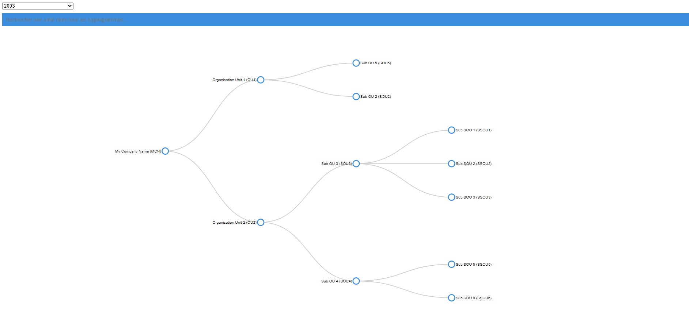
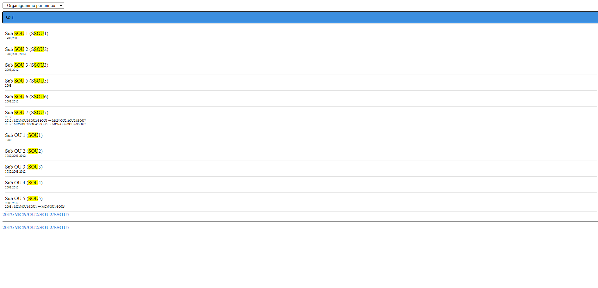
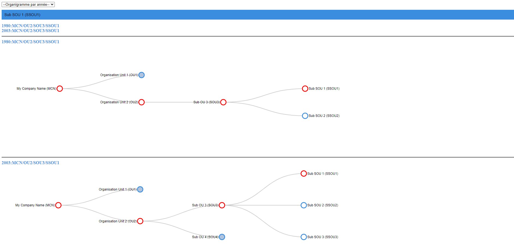

# Excel-organigram-viewer

## Description

This data-viz tool enables you to visualize under a dynamic tree diagram shape an arborescence described inline in an excel datasheet.

## Input

Excel datasheet with multi tabs like the example in the project:

| OU1: Organisation Unit 1 |                |                                                       |
|--------------------------|----------------|-------------------------------------------------------|
|                          | SOU5: Sub OU 5 |                                                       |
|                          | SOU3: Sub OU 3 |                                                       |
|                          |                |                                                       |
| OU2: Organisation Unit 2 |                |                                                       |
|                          | SOU2: Sub OU 2 |                                                       |
|                          |                | SSOU7: Sub SOU 7 (ex OU2/SOU2/SSOU1 + OU2/SOU4/SSOU5) |
|                          |                | SSOU6: Sub SOU 6                                      |
|                          |                | SSOU3: Sub SOU 3                                      |
|                          | SOU4: Sub OU 4 |                                                       |
|                          |                | SSOU2: Sub SOU 2                                      |

Comments displayed as tooltip can be added colon 14

## Output

<table>
<tr>
<td>  </td> 
</tr>
</table>

<table>
<tr> 
    <td>  </td>
	<td>  </td> 
</tr> 
</table>

## Installation

Server and dependencies are already in the repo so all you have to do is:

- Clone the source (git clone...)
- Launch the server executing historga/v{version}/server.bat
- Go on http://localhost:9615 (by default) in chrome or firefox

## Update excel database and reindex tree field

- Update historga/v{version}/data/Organigrammes MCN.xlsx
- Execute historga/v{version}/data/xlsx_to_json.bat
- Launch tool executing historga/v{version}/server.bat

## Changelog Synthax

- rename: Sub OU 5 (ex OU1/SOU1)
- fusion: Sub SOU 7 (ex OU2/SOU2/SSOU1 + OU2/SOU4/SSOU5)

